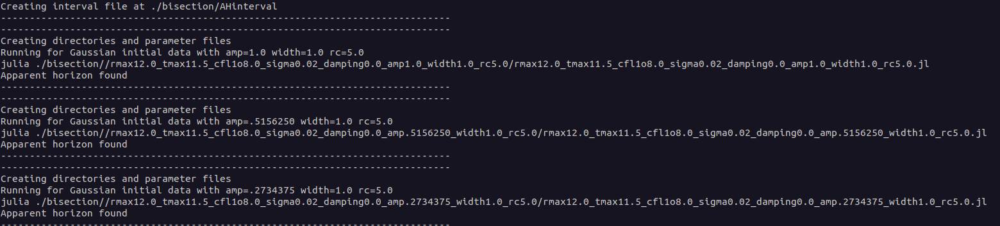

.. _examples:

Examples
=============

Here you can find instructions on how to run the examples included
with the package, in the terminal. You could also run the examples in
Julia's REPL or in Jupyter notebooks, but instructions are not
provided and there may be differences. All examples are under
``SpheriCo.jl/examples/``.

.. _examples-classical:

Classical
------------

A single classical simulation can be run with
``run_classical.jl``. To do so follow the steps:

1. Go to the directory of the examples.

2. Open the script ``run_classical.jl`` with your favourite text editor.

3. Tune the parameters according to what you want to simulate. There
   is a description of each parameter within the script.

4. There is no parallelization option for the classical simulation, so
   running with 1 thread (the default option) is all that is
   possible. Sometimes, more threads might get activated during the
   simulations (not sure why, based on experience with simulations in
   Ubuntu 22.04). It might be useful to run the following command

   .. code-block:: console

      export OMP_NUM_THREADS=1

   before running the script (see
   `here <https://github.com/JuliaLang/julia/issues/33409>`_ for a
   related discussion).

5. Run the script with

   .. code-block:: console

      julia run_classical.jl

   The data are saved in the file ``<root_dir>/data_<Nr>/``, where
   ``root_dir`` and ``Nr`` (number of points on the spatial grid) are
   parameters in ``run_classical.jl``.

When you run the classical simulation with fixed ``rmax``, the output
should look like this

.. image:: ../images/run_classical.png
  :width: 800

The top row explains what is the output on each column:

1. Simulation speed (momentarily) in terms of steps/hour. It is
   initiated as zero and can appear as ``Inf`` (very fast, does not
   affect the simulation). This speed is smaller for the first two
   steps, since the time integrator there is the 4th order
   Runge-Kutta, which is slower than the 3rd order Adams-Bashforth
   used mainly.

2. Iteration (or step) of the simulation.

3. Time (in code units) of the simulation. The information from
   columns 1-3 can be used to make a rough estimate of how long a
   given simulation can take. This is more complicated with an
   infalling ``rmax`` setup, because in this case the timestep gets
   smaller as the simulation progresses.

4. The maximum value of the classical scalar field :math:`{\Phi}`.

5. The minimum value of :math:`{\Phi}`.

6. The maximum of the absolute value of the variable :math:`{\Theta}`.
   It is initiated to zero and is proportional to the Hamiltonian
   constraint violation.

7. The maximum of the absolute value of the variable :math:`{Z_r}`.
   It is also initiated to zero and is proportional to the momentum
   constraint violation.

8. The minimum of the lapse function :math:`{\alpha}`.

9. The maximum of :math:`{\alpha}`. The information on columns 7,8 can
   indicate whether and apparent horizon forms (if min is close to
   zero and max is close to 1).
   
If you run with infalling ``rmax``, the output should look like this

In this case there are two extra columns (10,11) at the end:

10. The position of the apparent horizon ``r_AH``. If it is negative,
    there is no apparent horizon.

11. The position of the outer boundary ``rmax``.

If you choose to save data (set the relevant parameters to ``True``),
there are messages about it as simple lines.

.. _examples-bisection:

Classical bisection
--------------------

If you want to search for a critical solution (the threshold between
black hole and no-black hole) in a given classical setup, you can run
the shell script ``bisection.sh``. This script executes
``run_classical.jl`` for as long as ``aupper - alower <= damin``,
where ``aupper`` and ``alower`` refer to the amplitude of the initial
data for :math:`{\Phi}`, and ``damin`` is the desired difference
between ``aupper`` and ``alower``. To execute it, after you go to
``SpheriCo.jl/example``, run

   .. code-block:: console

      ./bisection.sh

The output should look like

Each individual simulation has a ``<run_name>`` like
*rmax12.0_tmax11.5_cfl1o8.0_sigma0.02_damping0.0_amp1.0_width1.0_rc5.0*,
automatically created by ``bisection.sh``. The data, are saved in
``SpheriCo.jl/examples/bisection/<run_name>/``, together with the
executable ``<run_name>.jl``, and the output ``<run_name>.log``.

.. _examples-simeclassical:

Semiclassical
------------

You can run a semiclassical simulation with ``run_quantum.jl``. The
steps are:

1. Go to the directory of the examples.

2. Open the script ``run_quantum.jl`` with your favourite text editor.

3. Tune the parameters according to what you want to simulate and save
   the changes. There is a description of each parameter within the
   script. Some of them are the same as in the classical case, but not
   all.

4. There is a parallelization option here. If you want to run with n
   threads, do

   .. code-block:: console

      export OMP_NUM_THREADS=1
      export JULIA_NUM_THREADS=n
      julia run_quantum.jl

   The command ``export OMP_NUM_THREADS=1`` is related to some
   possible parallelization issues (see `here
   <https://github.com/JuliaLang/julia/issues/33409>`_ for a related
   discussion). The data are saved in the file
   ``<root_dir>/data_<Nr>/``, where ``root_dir`` and ``Nr`` (number of
   points on the spatial grid) are parameters in ``run_quantum.jl``.

When you run the semiclassical simulation with fixed ``rmax``, the
output should look like this

This is almost the same as in ``run_classical.jl`` with fixed
``rmax``. The only difference is in columns 4,5:

4. Instead of the minimum of the classical scalar field
   :math:`{\Phi}`, it shows the maximum of its absolute value.

5. It shows the maximum of the absolute value of the most massive
   quantum mode with the maximum quantum number k,l. If you run
   without regularization, there is only one type of quantum modes
   (massless).

You can also execute ``run_quantum.jl`` with infalling ``rmax``, and
the output should be similar to

which is similar to the classical case (apart from the differences
mentioned just before).

.. _examples-checkpoints:

Run from a checkpoint
----------------------

You can also run your simulation (classical or semiclassical) from a
checkpoint. There is a parameter that you can tune to save checkpoints
every *x* hours. If there is a checkpoint, it will be saved under
``<root_dir>/data_<Nr>/``. You just need to run the script
(e.g. ``run_classical.jl`` in ``SpheriCo.jl/examples/``) with the
**same parameters and same** ``<root_dir>``. Make sure the time for
which you want to run (``tmax``) is greater than the time of the
checkpoint (and also that by changing it you are not changing
``<root_dir>``). The output should be something like this:

.. _examples-stop:

Stop the simulation
----------------------

If you want to stop your simulation for whatever reason, but you would
like to have a checkpoint to restart from the same time, there is a
way to do exactly that. Assuming you are running ``run_classical.jl``:

1. Go to ``SpheriCo.jl/examples/classical_runs/<root_dir>/data_<Nr>``.

2. Make a directory with the name *stop* by executing

   
   .. code-block:: console

      mkdir stop

   This should make the code exit the simulation, after saving a
   checkpoint. The output should be something like this:

   
      
**Be careful** if you want to perform convergence tests and you want
the simulations in the different resolutions to save data exactly at
the same timesteps. You might stop the code in a random place, with
respect to how often data are saved.
